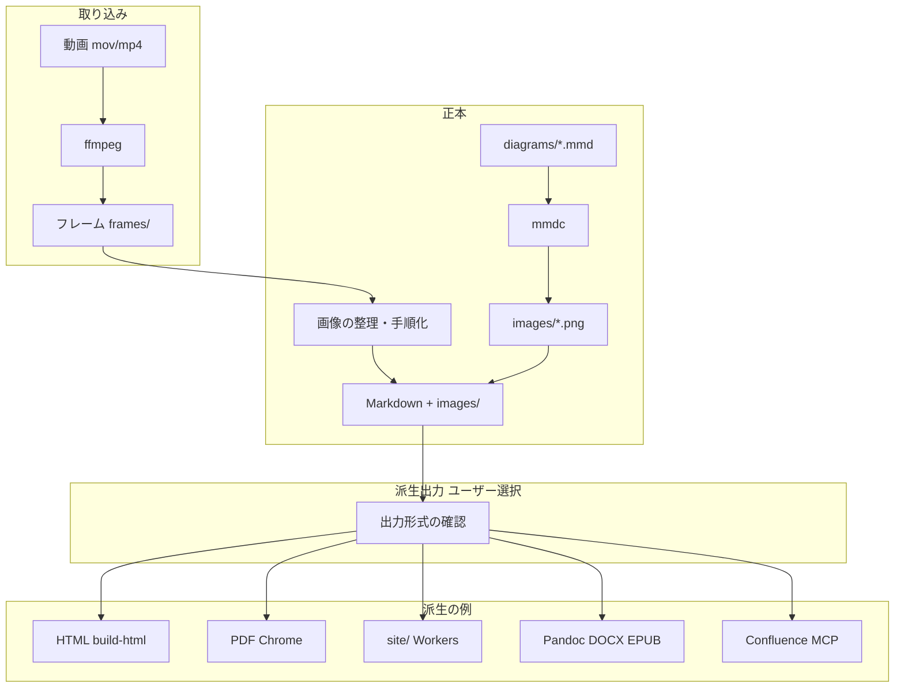

# mov-to-doc

画面操作の録画（mov / mp4 など）から、**操作マニュアル（Markdown）**・**画面キャプチャ**・**処理フロー図（Mermaid → PNG）**を作り、**ユーザーが選んだ派生形式**（**HTML** / PDF / Word / EPUB / Confluence 等）へ出力するための **CLI・エージェント向け手順（Skill）・テンプレート**をまとめたリポジトリです。**正本は常に Markdown + `images/`** で、**HTML は Web 閲覧用の第一派生**、PDF は印刷用派生の一つです。

**公式リポジトリ:** [https://github.com/rossoandoy/mov-to-doc](https://github.com/rossoandoy/mov-to-doc)

**実運用例（推奨スタック）:** [manabie-tomas-mypage-manual](https://manabie-tomas-mypage-manual.rossoando.workers.dev/)（[GitHub](https://github.com/rossoandoy/manabie-tomas-mypage-manual)）— mov-to-doc の HTML 出力 + Cloudflare Workers（Static Assets + R2 動画）で公開。

---

## 推奨: HTML + Cloudflare Workers

画面録画マニュアルを **業務ユーザーに届ける** なら、**HTML（Step G）→ `site/` → Cloudflare Workers（Step H）** が第一選択肢です。PDF や Confluence より先に検討する価値があります。

| 利点 | 内容 |
|------|------|
| **Chrome 不要** | `build-html.mjs` だけで Web 品質の UI（目次・手順カード・画像拡大・UAT バッジ） |
| **低コスト公開** | Workers Static Assets + R2 無料枠で UAT 規模は実質 0 円 |
| **大容量動画** | 25MB 超の参照録画は R2 + Worker `/videos/*` で HTML5 再生 |
| **Markdown 正本** | `.md` を編集 → `npm run build:web` → `wrangler deploy` で即反映 |
| **現場 UX** | タブレット・教室 PC から URL 一つで参照、操作録画も同ページ内 |

```bash
# 典型フロー（manual リポジトリ）
cd manuals/<slug> && npm run build:web
node scripts/upload-video-r2.mjs   # 参照動画がある場合
npx wrangler deploy
```

詳細は [SKILL.md Step G〜H](SKILL.md) と [reference.md](reference.md) の Cloudflare 節。

---

## このリポジトリの位置づけ

| 要素 | 説明 |
|------|------|
| **CLI（[cli.mjs](cli.mjs)）** | `npm install -g` でグローバル利用。**init** / **build html\|pdf\|site** / **skill install** |
| **Skill（[SKILL.md](SKILL.md)）** | AI や人間が従う **手順書**（Markdown）。Step A〜D（抽出〜本文〜図）、**Step E で派生出力をユーザーに確認**、**Step G で HTML**、Step F で **PDF（任意）**、**Step H で Cloudflare Workers デプロイ**。**キャプチャ品質（Step A'）**と品質チェックあり。**1 回の指示で複数動画が指定されても、動画ごとに最適化（テンプレ一括禁止・品質優先）**。 |
| **テンプレート（[templates/](templates/)）** | 実プロジェクトの作業フォルダに **コピーして使う** ビルド用ファイル群。`build-html.mjs`・`build-pdf.mjs`・`prepare-site.mjs`・`package.json`・Mermaid ひな型など。 |
| **リファレンス（[reference.md](reference.md)）** | ffmpeg / Pandoc / 派生出力の一覧・Cloudflare デプロイ・PDF コマンド早見。 |

「Skill」は各 AI 製品の **Skills ディレクトリに置けるドキュメント**としても、**単なるプロジェクト内 Markdown** としても利用できる。製品ごとに frontmatter（YAML）の書式だけ合わせればよい。

---

## 前提条件

### 実行環境（必須）

次が **ローカルマシン（または CI ランナー）上**で利用可能であること。ブラウザ版チャットのみでは ffmpeg / npm を実行できない場合がある。

| 要件 | 内容 |
|------|------|
| **OS** | macOS / Windows / Linux（パス区切り・Chrome の場所は OS 依存） |
| **ffmpeg** | 動画から静止画フレームを抽出する。`ffprobe` が無くても `ffmpeg -i` で長さ・ストリーム確認は可能。 |
| **Node.js** | **LTS 推奨**。`npm` で依存パッケージを入れる。 |
| **Chrome または Chromium** | **PDF 派生**に使う場合。**ヘッドレス Chrome** で HTML を印刷（`puppeteer-core`）。既定パスに無い場合は **`CHROME_PATH`** で指定。 |
| **Pandoc**（任意） | DOCX / HTML / EPUB / 簡易 PPTX など。**派生形式**をコマンド一発で出すとき。 |
| **シェル** | 動画パスにスペースが含まれる場合は **クォート**が必要。 |

### 入力・成果物の前提

- **入力:** 画面録画ファイル（mov / mp4 等）。長時間はフレーム間隔を広げてトークンと枚数を抑える（[SKILL.md](SKILL.md) Step A 参照）。
- **成果物の置き場:** `manual/` など **一つの作業ディレクトリ**に、Markdown・`images/`・`diagrams/`・（必要なら）PDF や DOCX など派生ファイルをまとめる想定。
- **AI の利用:** 必須ではない。人間が [SKILL.md](SKILL.md) に従って手作業でもよい。AI を使う場合は **画像の内容把握・本文草案・Mermaid 草案**に向く。

---

## 技術要素（スタック）

| 区分 | 技術 | 役割 |
|------|------|------|
| 動画処理 | **ffmpeg** | 可変フレームレートで JPG 等へ書き出し、解像度を `scale` で抑制。 |
| マークダウン | **marked** | `build-html.mjs` / `build-pdf.mjs` が `.md` を **HTML** に変換。 |
| **HTML 生成** | **build-html.mjs** + **render-manual.mjs** | 業務ユーザー向け Web HTML（目次・手順カード・画像拡大）。**Chrome 不要**。 |
| PDF 生成 | **puppeteer-core** + **Chrome** | 印刷用 HTML を **`page.pdf()`** で A4 PDF 出力。 |
| 図 | **@mermaid-js/mermaid-cli**（`mmdc`） | Mermaid ソースを **PNG にレンダリング**（多くの PDF パイプラインでは Mermaid のコードブロックだけでは図にならないため）。 |
| 派生（任意） | **Pandoc** | Markdown から **DOCX / HTML / EPUB** 等（環境にインストールが必要）。 |
| Wiki（任意） | **Atlassian MCP** 等 | **Confluence** へのページ作成・添付は MCP のツール定義に従う。 |

依存バージョンは [templates/package.json](templates/package.json) を参照。

---

## アーキテクチャ

データの流れの中心は **「録画 → フレーム画像 → Markdown + images/（正本）→ 図 PNG」** である。その後 **ユーザーが選んだ派生** へ分岐する（PDF は代表的な一本）。



- **HTML パイプライン（推奨）:** `operation_manual.md` → `index.html` → `site/manuals/<slug>/`（[templates/build-html.mjs](templates/build-html.mjs)）。
- **Cloudflare 公開（推奨）:** `site/` を Workers Static Assets、参照動画を R2 で配信（Step G + H）。実例: [manabie-tomas-mypage-manual](https://manabie-tomas-mypage-manual.rossoando.workers.dev/)。
- **PDF パイプライン（オプション）:** `operation_manual.md` → 一時 HTML → `operation_manual.pdf`（[templates/build-pdf.mjs](templates/build-pdf.mjs)）。
- **その他:** [reference.md](reference.md) の Pandoc 例・Confluence チェックリストを参照。
- **複数マニュアル:** 入出力ファイル名を引数で変える、または `package.json` に用途別 `build:*` を定義する（上書き方針は後述）。

---

## 処理内容（パイプライン概要）

[SKILL.md](SKILL.md) の Step A〜F に対応する処理の要約である。

| 段階 | 内容 |
|------|------|
| **Step A / A'** | フレーム抽出と **キャプチャ品質**（スピナー等を採用しない）。 |
| **Step B** | フレームを **時系列**で読み、画面遷移・操作・エラー有無を整理する（人間またはマルチモーダル LLM）。 |
| **Step C** | `operation_manual.md`（またはトピック別 `.md`）を執筆。各手順に `./images/` のキャプチャを埋め込む。 |
| **Step D** | `diagrams/*.mmd` を `mmdc` で PNG 化し、本文から `` で参照。 |
| **Step E** | **ユーザーに派生出力を確認**（PDF / DOCX / Confluence 等。複数可）。 |
| **Step F** | **PDF が選ばれた場合** `build-pdf.mjs` が Markdown→HTML→PDF。他形式は Pandoc / MCP 等（[reference.md](reference.md)）。既存 PDF の誤上書きに注意。 |

クリーンアップとして、解析用 **`frames/`** は作業後に削除してよい（リポジトリにコミットしない運用が一般的）。

---

## リポジトリに含まれるもの

| パス | 役割 |
|------|------|
| [SKILL.md](SKILL.md) | **メイン手順書**（Step A〜F・派生選択・品質チェック・PDF 上書き時の注意）。 |
| [reference.md](reference.md) | ffmpeg / Pandoc / 派生出力一覧・チェックリスト。 |
| [templates/](templates/) | 作業フォルダへコピーする **`build-pdf.mjs`**・**`package.json`**・フロー図のひな型。 |

---

## 各種 AI ツールでの利用開始ガイド

### 1. Cursor（推奨：ターミナル連携がしやすい）

1. 本リポジトリを clone するか、[SKILL.md](SKILL.md) を取得する。
2. Cursor の Agent Skills 用ディレクトリに **`SKILL.md` と `reference.md`** を置く（例: `mkdir -p ~/.cursor/skills/mov-to-doc && cp SKILL.md reference.md ~/.cursor/skills/mov-to-doc/`）。プロジェクト直下の `.cursor/rules` に要約を置く方法でもよい。
3. 作業用フォルダ（例: `manual/`）に [templates/](templates/) をコピーし、`npm install` 済みにしておく。
4. チャットで「`mov-to-doc` の SKILL に従って、`○○.mov` からマニュアルを作り、**出力は Markdown と PDF**（例）」のように **派生形式**を指定して依頼する。

**活用のコツ:** 動画パスと成果物の出力先（フォルダ）を最初のメッセージで明示すると迷いが減ります。

---

### 2. Claude Code / Claude Desktop

1. リポジトリを clone するか、`SKILL.md` をプロジェクトにコピーする（例: `docs/skills/mov-to-doc/SKILL.md`）。
2. Anthropic 公表の **プロジェクト設定（Skills / CLAUDE.md 等）** に従い、**Skills** や **CLAUDE.md** に「録画マニュアル作成は `docs/skills/.../SKILL.md` に従う」と一文入れておくと毎回の説明が省けます。
3. frontmatter（YAML）は、Claude Code の Skill 形式に合わせて **名前や description だけ調整**してよい。

**活用のコツ:** 長い `SKILL.md` を毎回読ませるより、**「Step A〜E の一行要約」** を `CLAUDE.md` に書き、詳細はファイル参照にするとトークンを節約できます。

---

### 3. GitHub Copilot（VS Code / JetBrains）

1. リポジトリをワークスペースに開く。
2. **Custom instructions** または **プロンプト用メモ**に、[SKILL.md](SKILL.md) の「Step A〜E」の見出しと [reference.md](reference.md) の ffmpeg 例を貼る。
3. Copilot Chat で「この手順で `manual/` の PDF を更新して」と依頼する。

**活用のコツ:** `SKILL.md` をリポジトリにコミットしておくと `@workspace` 参照がしやすくなります。

---

### 4. ChatGPT / Google Gemini（Web）

1. [SKILL.md](SKILL.md) の必要なセクションをコピーするか、ファイルをアップロードできるプランで添付する。
2. 「この手順に従い、抽出したフレームの説明から Markdown 案を書いて」と依頼する。

**制約:** ブラウザ版だけでは **ffmpeg・npm を実行できない**ことが多い。**AI:** フレームの説明・Markdown・Mermaid 草案。**人間（または Cursor 等）:** ffmpeg、`npm run build`、PDF 生成。

---

### 5. その他（Gemini CLI、ローカル LLM 等）

- `SKILL.md` は **プレーンな Markdown** のため、クライアントを問わず参照可能。
- ローカル LLM は **Step を細かい単位で依頼**すると追従しやすい。

---

## 活用ガイドライン（共通）

1. **環境を先に揃える:** 上記 [前提条件](#前提条件実行環境必須) を満たす。
2. **作業ディレクトリを一箇所に決める:** 例として `manual/` に `templates/` を展開し、動画・画像・Markdown・PDF をまとめる。
3. **複数トピックのマニュアル:** 入出力ファイル名を分ける（例: `TopicA.md` → `TopicA.pdf`）。既定の `operation_manual.pdf` を繰り返しビルドすると **上書き**される。詳細は下記「PDF の上書き方針」。
4. **機密情報:** 録画・キャプチャに個人情報が含まれる場合はマスクやダミー値にするか、社内ルールに従う。
5. **最終責任:** 画像の誤認や手順抜けは **人間がレビュー**し、貴社固有の業務ルールは文書化ルールに合わせる。

---

## PDF の上書き方針（重要）

- **別トピック**では `Manabie_退会.md` → `Manabie_退会.pdf` のように **ファイル名を分ける**。
- **エージェント:** 既存の共有 PDF を上書きしそうなときは **ユーザーに確認してから**実行してよい。
- **`build-pdf.mjs`:** 既定では既存 PDF があると **警告してから上書き**。厳格に止めたいときは **`MANUAL_PDF_STRICT_OVERWRITE=1`**、上書き時は **`--force`**。詳細は [SKILL.md](SKILL.md) Step E と [reference.md](reference.md)。

---

## グローバルインストール

```bash
git clone https://github.com/rossoandoy/mov-to-doc.git
cd mov-to-doc
npm link
# または: npm install -g github:rossoandoy/mov-to-doc

mov-to-doc skill install   # Cursor Skill を ~/.cursor/skills/ に配置
mov-to-doc init ./manuals/my-topic
```

## 2 リポジトリモデル

| リポジトリ | 役割 |
|-----------|------|
| **[mov-to-doc](https://github.com/rossoandoy/mov-to-doc)** | ツール本体（CLI、Skill、テンプレート） |
| **各 manual リポジトリ**（例: [manabie-tomas-mypage-manual](https://github.com/rossoandoy/manabie-tomas-mypage-manual)） | 動画（Git LFS）、Markdown、HTML、公開用 `site/` |

---

## クイックスタート

1. 作業フォルダ（例: `manual/`）に **[templates/](templates/) の中身をコピー**する。
2. `operation_manual.md` と `images/` を用意する（または AI に SKILL に従って作成させる）。
3. 必要なら `diagrams/process_flow.mmd` を編集する。
4. 依存関係を入れてビルドする。

```bash
cd manual
npm install
npm run html          # Web HTML
npm run site          # site/ へ配置（Workers 用）
npm run build:web     # diagram + html + site
# PDF が必要な場合: npm run build
```

生成物の例: `index.html`、`site/manuals/<slug>/`、`images/process_flow.png`

**複数マニュアル**は `node build-html.mjs 別件.md 別件.html` や `npm run build:xxx` でファイル名を分ける。

---

## 配布・公開前のチェック

- `SKILL.md` の frontmatter（`name` / `description`）が意図どおりか
- `templates/package.json` の依存が手元で実行確認済みか
- `reference.md` のコマンドが現行手順と一致しているか
- サンプル画像・本文に **個人情報や社内秘密が含まれていないか**

---

## ライセンス

利用条件はリポジトリ利用者の方針に従ってください。未指定の場合は、利用前に作者へ確認することを推奨します。

---

## 参照

- リポジトリ: [https://github.com/rossoandoy/mov-to-doc](https://github.com/rossoandoy/mov-to-doc)
